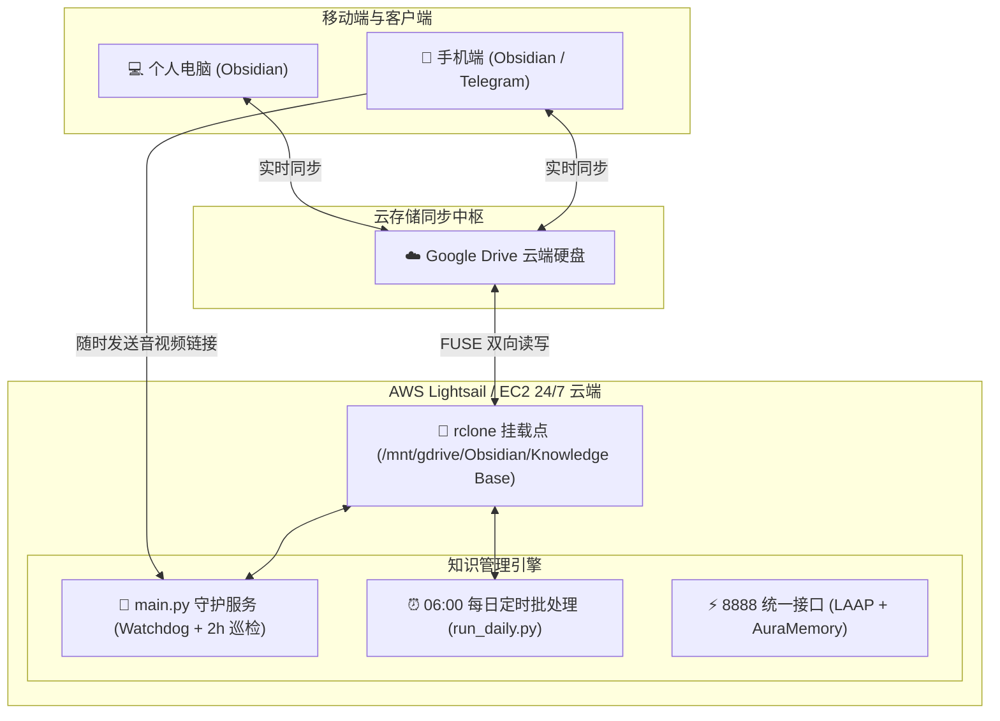

# ☁️ 知识管理引擎云端部署与每日定时运行全指南 (AWS Lightsail / EC2)

将 Obsidian 知识管理引擎放置在云端服务器（AWS Lightsail 或 EC2），可以彻底解决**“电脑无法一直开机、数天未开机导致复习卡片与任务滚雪球积压”**的痛点。

---

## 🎯 1. 为什么优先推荐 AWS Lightsail？

| 对比维度 | AWS Lightsail (🌟 强烈推荐) | AWS EC2 (按需) |
| :--- | :--- | :--- |
| **每月费用** | **\$3.5 或 \$5 / 月**（包干固定，约 25~35 元） | 弹性计费，较难预测 |
| **公网流量** | 每月赠送 **1 TB ~ 2 TB** 高速流量 | 流量按 GB 额外收费（\$0.09/GB） |
| **公网 IP** | 免费提供独立静态公网 IPv4 | 需单独申请 Elastic IP |
| **维护门槛** | 极简，网页自带 SSH 终端与防火墙 | VPC、子网、安全组相对复杂 |
| **推荐规格** | **1 vCPU / 1GB 或 2GB 内存 / 40GB SSD** | `t4g.small` 或 `t3.micro` |

> 💡 **系统镜像选择**：Ubuntu 22.04 LTS 或 Ubuntu 24.04 LTS。

---

## 🏗️ 2. 云端整体数据流与运行拓扑



---

## 🚀 3. 三步极速云端部署

### 第一步：连接服务器并克隆代码

在你的 Lightsail 控制台打开 SSH 终端（或本地终端 `ssh ubuntu@<你的公网IP>`）：

```bash
# 1. 克隆代码仓库
git clone https://github.com/elvinhui/Obsidian_Organizer.git ~/Obsidianorganizer
cd ~/Obsidianorganizer

# 2. 准备环境变量文件 .env
cp .env.example .env 2>/dev/null || touch .env
nano .env
```

在 `.env` 中填入你的核心密钥：
```env
GEMINI_API_KEY=your_gemini_api_key_here
TELEGRAM_BOT_TOKEN=your_telegram_bot_token_here
OBSIDIAN_BASE_PATH=/mnt/gdrive/Obsidian/Knowledge Base
```
*(注意：路径严格保持 `/mnt/gdrive/Obsidian/Knowledge Base`，严禁末尾空格！)*

---

### 第二步：执行一键环境初始化脚本

我们已经为你编写好了自动化部署脚本 [`scripts/deploy_cloud.sh`](file:///c:/Users/KATANA%2017%20B13V/Documents/projects/Obsidianorganizer/scripts/deploy_cloud.sh)：

```bash
chmod +x scripts/deploy_cloud.sh
./scripts/deploy_cloud.sh
```

该脚本会自动执行：
1. **时区纠正**：设置系统为 `Asia/Shanghai`（中国标准时间 UTC+8）。
2. **虚拟内存**：自动创建 2GB Swap，防止小内存实例在多模态抽取时 OOM 崩盘。
3. **系统依赖**：安装 `python3-venv`、`ffmpeg`（音频榨汁必需）、`rclone` 等。
4. **Python 环境**：配置独立虚拟环境并完整安装 `requirements.txt`。
5. **系统服务模板**：预置 `rclone_obsidian.service` 和 `obsidian_organizer.service`。

---

### 第三步：配置 rclone 授权并启动

让服务器挂载你的 Google Drive：

```bash
# 1. 交互式配置 Google Drive
rclone config
# -> 按 n 新建远程连接，命名为: gdrive
# -> 选择 Google Drive (通常为数字序号)
# -> client_id / secret 直接回车
# -> Scope 选 1 (Full Access)
# -> 在无桌面终端选 n (不使用自动配置)，在本地电脑打开链接获取授权码并粘贴

# 2. 启动开机自启挂载服务
sudo systemctl enable --now rclone_obsidian

# 3. 验证挂载是否成功
ls -la "/mnt/gdrive/Obsidian/Knowledge Base"
```

---

## ⏰ 4. 每日定时运行的两种工作模式

根据你的需求，可选择以下任一模式运行：

### 模式 A：24/7 全能守护进程（推荐 ⭐⭐⭐⭐⭐）

适合希望**“随时随地往 Telegram 扔链接自动榨汁 + 每天定时巡检”**的用户。

```bash
# 启动引擎开机自启
sudo systemctl enable --now obsidian_organizer

# 查看实时运行日志
sudo journalctl -u obsidian_organizer -f
```

- **全天候监听**：你白天在手机上通过 Telegram 扔推文、B站/YouTube/抖音链接，云端秒级解析并生成 If-Then 战备卡片写入知识库。
- **单日幂等巡检**：内置调度器每 2 小时自检，在每天早晨自动产出 **今日限额 7 张复习清单**、**知识日报**、**北极星看板** 与 **LAAP 分身推演**，且日内后续轮询 0 额外消耗。

---

### 模式 B：纯 Cron 晨间批处理模式

如果你不需要 24 小时后台常驻，只希望每天清晨（如 06:00）运行一次：

在服务器终端输入：
```bash
crontab -e
```

在末尾添加以下定时任务：
```cron
# 每天清晨 06:00 (北京时间) 自动执行全量同步、日报与 7 张复习清单生成
0 6 * * * cd /home/ubuntu/Obsidianorganizer && /home/ubuntu/Obsidianorganizer/venv/bin/python src/run_daily.py >> /home/ubuntu/Obsidianorganizer/AI\ brain\ log/cron.log 2>&1
```

执行效果：每天早晨 06:00 准时苏醒，同步 Google Drive，完成 15 项流程作业后优雅退出。

---

## 🛠️ 5. 常见运维与监控命令

```bash
# 查看知识引擎运行状态
sudo systemctl status obsidian_organizer

# 重启知识引擎
sudo systemctl restart obsidian_organizer

# 手动立刻跑一次全流程
cd ~/Obsidianorganizer
source venv/bin/activate
python src/run_daily.py

# 查看当天的 AI Brain 日志
tail -f "AI brain log/$(date +%Y-%m-%d).log"
```
